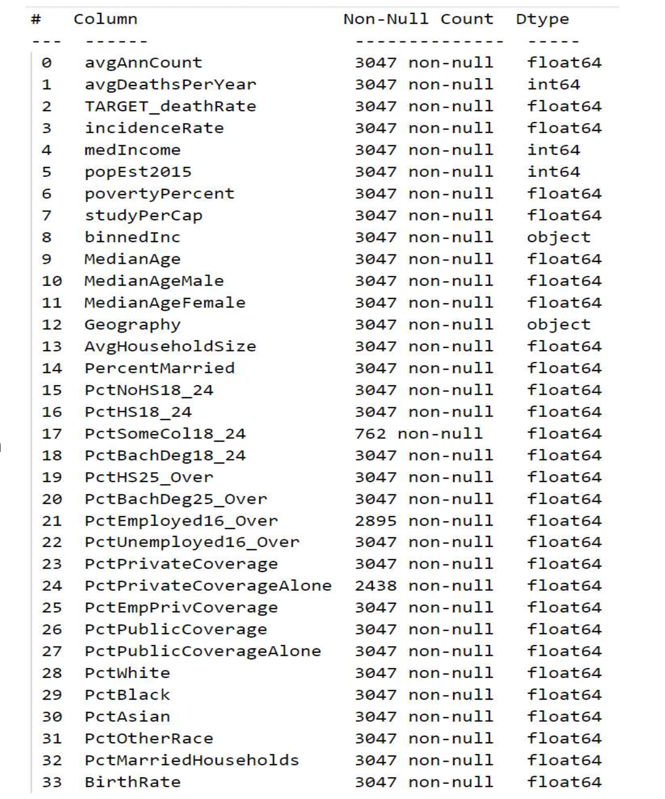
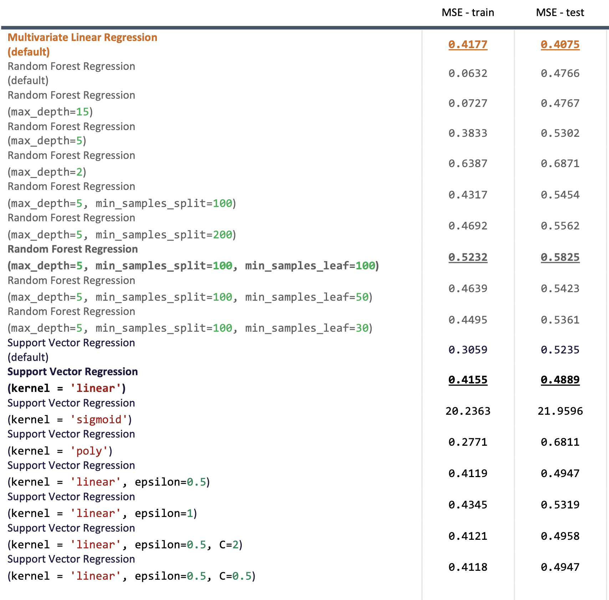

Predict Cancer Mortality Rate
==============================
Full report can be found : [Assignment D - KaiPing Wang.pdf](reports/Assignment%20D%20-%20KaiPing%20Wang.pdf)

## Business Objective

The goal of this experiment is to accurately predict cancer mortality based on information related to US counties.The dataset contains 33 different features (demography, medical information).

Being able to accurately predict cancer mortality can help to uncover some key correlation between features, and assist further discussion around how to manage and reduce cancer mortality.

## Data Collection
The data used in this experiment is coming from
https://raw.githubusercontent.com/aso-uts/applied_ds/master/assignment1/cancer_reg.csv [cancer-reg.csv](https://raw.githubusercontent.com/aso-uts/applied_ds/master/assignment1/cancer_reg.csv)

## Data Exploration

- Some features have up to 75% missing values, which makes them **NOT** suitable to be included in the prediction model.
- Some features have up to 70% potential erroneous values,these values look peculiar and almost impossible based on common sense.
These features are still included in the modeling stage; however, may contribute to the poor performance due to the potential quality issue.
**We shall go back to the data providers to review and rectify any issues in these features.**
- Some features have minor unreasonable values that seems to be typo and can be calculated back to be in line with the rest of the value.
**These features are included in the modeling stage by using data processing to bring them into reasonable value.**
- When sorting the dataset based on **TARGET_deathRate** in descending order, it is noticed that the **Geography** information is also sorted in groups by **state**. Similar trend can be observed in features **incidenceRate** and **studyPerCap**; however, there are lots of potential erroneous values in these two features.
## Form Hypotheses
- **Higher the incidence rate, higher the cancer mortality**. It is easy to
assume that higher the case numbers, higher the death counts.
However, if the treatment is proper and in time, the incident rate should not be highly related to death rate. If they are highly related, then the treatment of cancer should be revisited or further investigated.
This can have further indication on if patients receive different treatment based on what insurance they have, or if different treatments were given out based on location or race...etc
- **Based on the potential matching trend of Geography**, the health insurance coverage, medical treatment, education level and cancer awareness...etc are something to look further into.

## Data Preparation
### Select Data
- Exclude **PctSomeCol18_24** as too much missing data
- Exclude **PctPrivateCoverageAlone** & **PctEmployed16_Over** as there are some missing data, and there’s no apparent matching trend with TARGET_deathRate.
### Clean Data
- **AvgHouseholdSize** has some value between 0 and 1, which doesn’t make sense. Hence, bring those value from float to integer by multiplying 100.
- **MedianAge** has some value larger than 100, which doesn’t make sense. Hence, bring those value to number between 1 and 100 by dividing by 10.
### Feature Engineering
- Split **Geography** into **State** and **County**, and do one-hot encoding on State feature to transform into dummy variables. Once it’s done, exclude geography, state and county features.
- Map **binnedInc** into integers that scale from 1 to 10 based on the bracket.
### Format Data
- Feature scaling using **StandardScaler** to standardize all features on
training set only.
- Standardize testing set using the StandardScaler fitted by training set to avoid data leakage.

## Model Selection
Select a number of regression models as candidates, and pick the final champion in evaluation stage based on performance. Also fine tune these models further using hyperparameters.
- **Multivariate Linear Regression**
- **Random Forest Regression**
  - max_depth
  - max_leaf_nodes
  - min_samples_leaf
- **Support Vector Regression**
  - Kernel
  - C
  - Epsilon
## Model Evaluation
### Baseline

### Experiments
Mean Square Error is used to evaluate the performance of each model included in this experiment. The goal is to find a consistent MSE across both training set and test set, and not overfitting nor underfitting. **Below is the result of all tried models, and the highlighted ones are the best of each algorithm.**

## What's next
The best model in this experiment is Multivariate Linear Regression; however, the performance is not good enough for production deployment. Although the MSE is consistent between training set and test set, it is still too high for deployment.

When removing all potential erroneous values from incidenceRate and studyPerCap, the MSE has dropped significantly and the performance is promising. This shows both features have great significance in predicting the cancer mortality accurately.

However, by doing so, the meaningful dataset has dropped to 30% only. If there are some issues in capturing these features in any counties or in the system, then the future prediction is still not reliable as values of these two features may be erroneous.

**The recommended next step is to discuss with data provider to review both features (incidenceRate and studyPerCap) and rectify any issues if there are. Once this is completed, rerun the model with latest data and check the performance again.**

Project Organization
------------

    ├── LICENSE
    ├── Makefile           <- Makefile with commands like `make data` or `make train`
    ├── README.md          <- The top-level README for developers using this project.
    ├── data
    │   ├── external       <- Data from third party sources.
    │   ├── interim        <- Intermediate data that has been transformed.
    │   ├── processed      <- The final, canonical data sets for modeling.
    │   └── raw            <- The original, immutable data dump.
    │
    ├── docs               <- A default Sphinx project; see sphinx-doc.org for details
    │
    ├── models             <- Trained and serialized models, model predictions, or model summaries
    │
    ├── notebooks          <- Jupyter notebooks. Naming convention is a number (for ordering),
    │                         the creator's initials, and a short `-` delimited description, e.g.
    │                         `1.0-jqp-initial-data-exploration`.
    │
    ├── references         <- Data dictionaries, manuals, and all other explanatory materials.
    │
    ├── reports            <- Generated analysis as HTML, PDF, LaTeX, etc.
    │   └── figures        <- Generated graphics and figures to be used in reporting
    │
    ├── requirements.txt   <- The requirements file for reproducing the analysis environment, e.g.
    │                         generated with `pip freeze > requirements.txt`
    │
    ├── setup.py           <- makes project pip installable (pip install -e .) so src can be imported
    ├── src                <- Source code for use in this project.
    │   ├── __init__.py    <- Makes src a Python module
    │   │
    │   ├── data           <- Scripts to download or generate data
    │   │   └── make_dataset.py
    │   │
    │   ├── features       <- Scripts to turn raw data into features for modeling
    │   │   └── build_features.py
    │   │
    │   ├── models         <- Scripts to train models and then use trained models to make
    │   │   │                 predictions
    │   │   ├── predict_model.py
    │   │   └── train_model.py
    │   │
    │   └── visualization  <- Scripts to create exploratory and results oriented visualizations
    │       └── visualize.py
    │
    └── tox.ini            <- tox file with settings for running tox; see tox.readthedocs.io

--------

<small>Project based on the <a target="_blank" href="https://drivendata.github.io/cookiecutter-data-science/">cookiecutter data science project template</a>. #cookiecutterdatascience</small>

