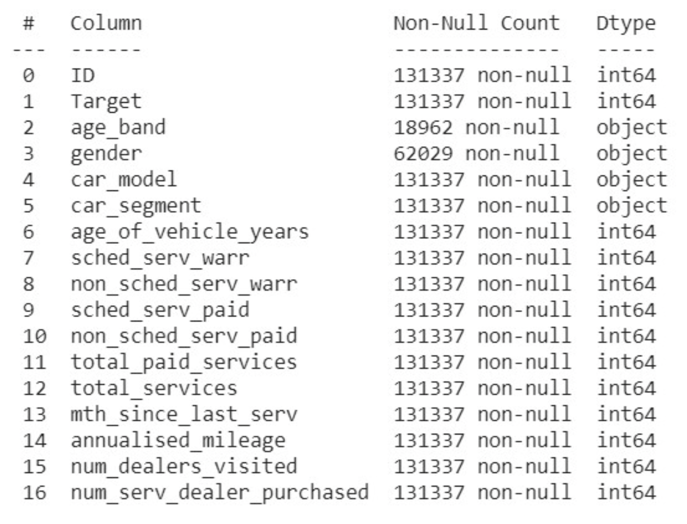
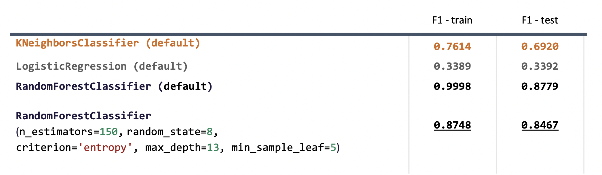
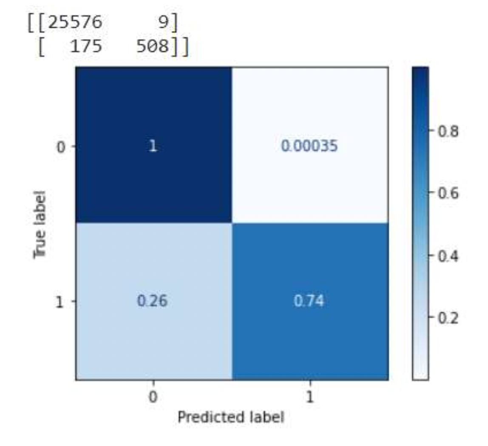
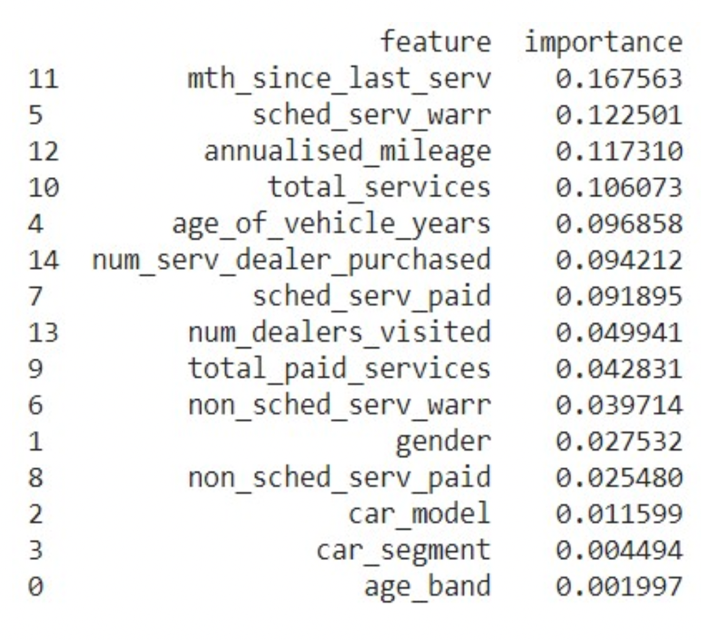

assignment-2
==============================

Full report can be found : [Assignment 2 - KaiPing Wang.pdf](reports/Assignment%202%20-%20KaiPing%20Wang.pdf)

## Business Objective
The goal of this experiment is to accurately predict if an existing customer is more likely to buy a new car. The dataset contains 16 different features (age_band, gender, car_model ... etc).

The result of this model can be used for targeting leads of a marketing campaign.

## Data Collection
The data used in this experiment is coming from
https://raw.githubusercontent.com/aso-uts/applied_ds/master/assignment2/repurchase_training.csv[repurchase_training.csv](https://raw.githubusercontent.com/aso-uts/applied_ds/master/assignment2/repurchase_training.csv)

## Data Exploration

As the question being asked here is if a customer is likely to buy a new car, so the answer is either true or false. When checking the Target value on value counts, **we can see the dataset is extremely imbalanced with 98:2 ratio. This means the performance on positive may be affected. The metric to be used for measuring the classifier performance needs to have weighted concept (F1 or MCC)**.

## Form Hypotheses
- **Customers with older cars are more likely to buy.**
  - When a car being driven for a long time, there are more factors to encourage the owner to buy a new car. For example, the maintenance cost, fuel efficiency, missing out new features...etc
  - Therefore, the assumption here is higher the age_of_vehicle_years, more likely a customer is looking to buy a new car.
- **Customers use the car frequently are more likely to buy.**
  - When customers use their cars more, it indicates that cars are important in their day-to-day life, and their cars have more wear and tear. This implies that they are more likely to invest in buying a better car.
  - Feature annualised_mileage is one indication in this area to see how much owners use their cars.

## Data Preparation
### Select Data
- Use all features
### Clean Data
- Some missing data in age_band and gender. Due to the potential feature significance, instead of replacing missing value with existing value, we are using ‘OTHERS’ for missing value. By doing this, we don’t contaminate the importance of existing value.
### Feature Engineering
- Label encoding all categorical data.

## Model Selection
Select a number of classifier models as candidates, and pick the final champion in evaluation stage based on performance. Fine tune these models further using hyperparameters.
- LogisticRegression
- KNeighborsClassifier
- RandomForestClassifier
  - random_state
  - criterion
  - n_estimators
  - max_depth

## Model Evaluation
### Baseline

### Experiments
F1 Score is used to evaluate the performance of each model included in this experiment. The goal is to find a good F1 score across both training set and test set, and not overfitting nor underfitting. **Below is the result of all tried models, and the highlighted ones are the best of each algorithm.**

The final pick is RandomForestClassifier with hyperparapeter tuned. This is because the difference in F1 score between training set and test set is much closer, and not too low in general. This means the model is neither overfitting nor underfitting.

## Confusion Metric
The confusion metrix on the right is derived from the final model picked from above with testing set data.
We can see that the negative prediction is very accurate, but the positive prediction is not very good in comparison.

In marketing perspective, it is not bad to include false positive into marketing campaign as they are potential prospects.

**However, being able to rule out true negative with high Confidence is important for the business to save cost.**

## Feature Importance
As we use Random Forest Classifer algorithm, we can extract feature importance from the model, and it is shown in the picture on the right.

How many months since last service has much higher significance compared to other features.
Gender and age_band have lots of missing value, so it is not surprising to see they have low significance in the final prediction model.

**Our original assumption on age_of_vehicle_years and annualized_mileage are among the top 5 features.**

## What's next
The best model based on F1 score in general is Random Forest Classifier. Although the default setting can achieve higher F1 score in general, the difference between training set and testing set is too large, which indicates the model is overfitting, and it may not be reliable for unseen data. The final model picked with hyperparameters tuned on max_depth and min_sample_leaf has much closer F1 score between training set and test set, and the performance isn’t underfitting.

Looking back to the original question of this experiment, business wants a model that can predict if a customer is likely to buy a car. Due to the imbalanced dataset, the final model can achieve high accuracy on predicting negative (not buying) and not very good accuracy on positive (buying). However, this model can certainly be used for targeting leads to marketing campaign as it can rule out the true negative with high confidence.

**Based on the business requirement, this model is able to rule out true negative with high confidence. Although the false positive is bit high, in marketing campaign perspective, the impact is not bad. Therefore, it is recommended to deploy this model into Production.

It is also recommended to capture more positive observation for future training to achieve higher accuracy on true positive.**

Project Organization
------------

    ├── LICENSE
    ├── Makefile           <- Makefile with commands like `make data` or `make train`
    ├── README.md          <- The top-level README for developers using this project.
    ├── data
    │   ├── external       <- Data from third party sources.
    │   ├── interim        <- Intermediate data that has been transformed.
    │   ├── processed      <- The final, canonical data sets for modeling.
    │   └── raw            <- The original, immutable data dump.
    │
    ├── docs               <- A default Sphinx project; see sphinx-doc.org for details
    │
    ├── models             <- Trained and serialized models, model predictions, or model summaries
    │
    ├── notebooks          <- Jupyter notebooks. Naming convention is a number (for ordering),
    │                         the creator's initials, and a short `-` delimited description, e.g.
    │                         `1.0-jqp-initial-data-exploration`.
    │
    ├── references         <- Data dictionaries, manuals, and all other explanatory materials.
    │
    ├── reports            <- Generated analysis as HTML, PDF, LaTeX, etc.
    │   └── figures        <- Generated graphics and figures to be used in reporting
    │
    ├── requirements.txt   <- The requirements file for reproducing the analysis environment, e.g.
    │                         generated with `pip freeze > requirements.txt`
    │
    ├── setup.py           <- makes project pip installable (pip install -e .) so src can be imported
    ├── src                <- Source code for use in this project.
    │   ├── __init__.py    <- Makes src a Python module
    │   │
    │   ├── data           <- Scripts to download or generate data
    │   │   └── make_dataset.py
    │   │
    │   ├── features       <- Scripts to turn raw data into features for modeling
    │   │   └── build_features.py
    │   │
    │   ├── models         <- Scripts to train models and then use trained models to make
    │   │   │                 predictions
    │   │   ├── predict_model.py
    │   │   └── train_model.py
    │   │
    │   └── visualization  <- Scripts to create exploratory and results oriented visualizations
    │       └── visualize.py
    │
    └── tox.ini            <- tox file with settings for running tox; see tox.readthedocs.io

--------

<small>Project based on the <a target="_blank" href="https://drivendata.github.io/cookiecutter-data-science/">cookiecutter data science project template</a>. #cookiecutterdatascience</small>

